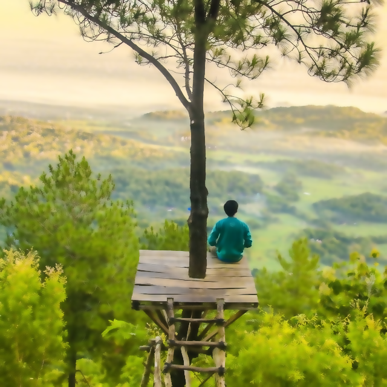
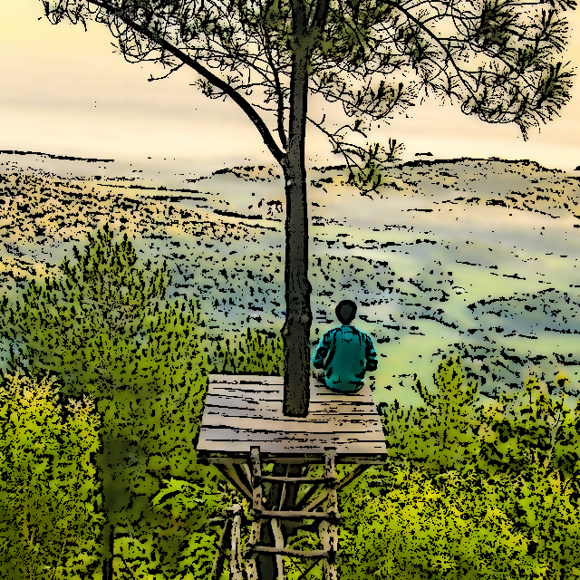
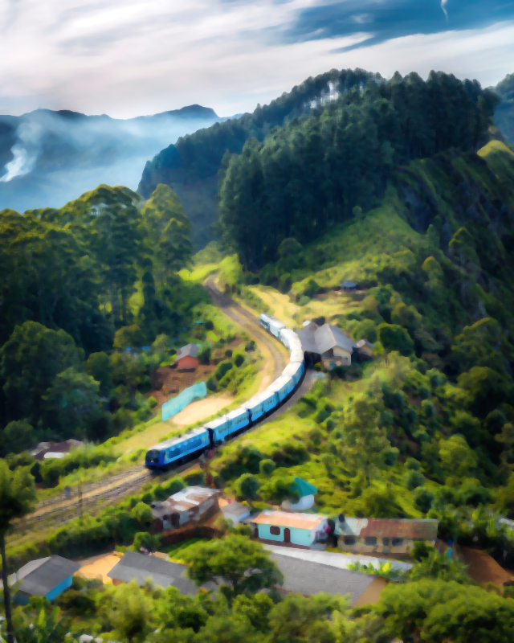
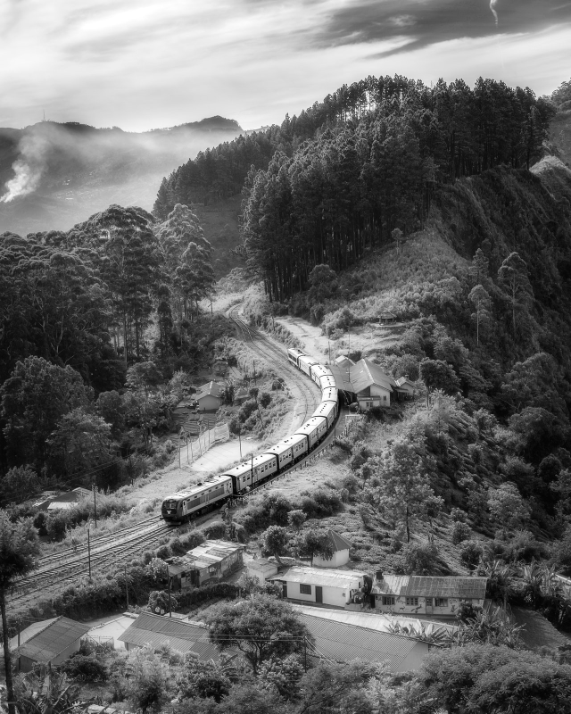

# **Image Filters**

Generates different image filters using openCV

## **Installation**

Clone the repository, then cd to image-filters and run:

```bash
pip install -r requirements.txt
```

## **Usage**

```bash
python3 main.py
```


## **Outputs**

Painting



Toonified



Blurred



GrayScale




**Note:** You will find the outputs in: ```outputs/``` folder unless you specify a different path
